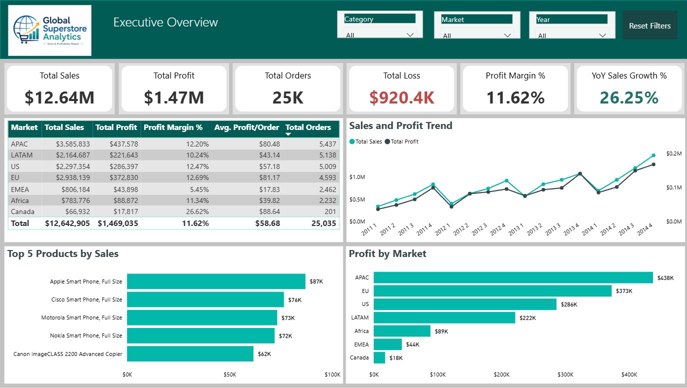
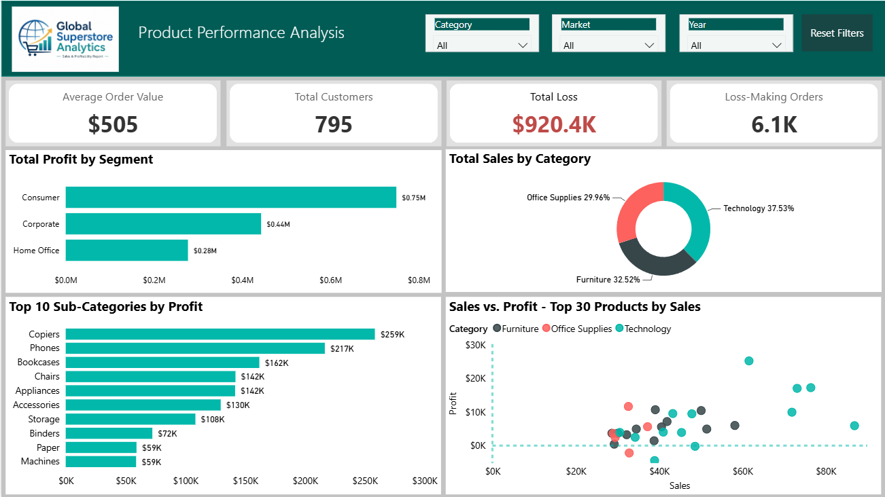
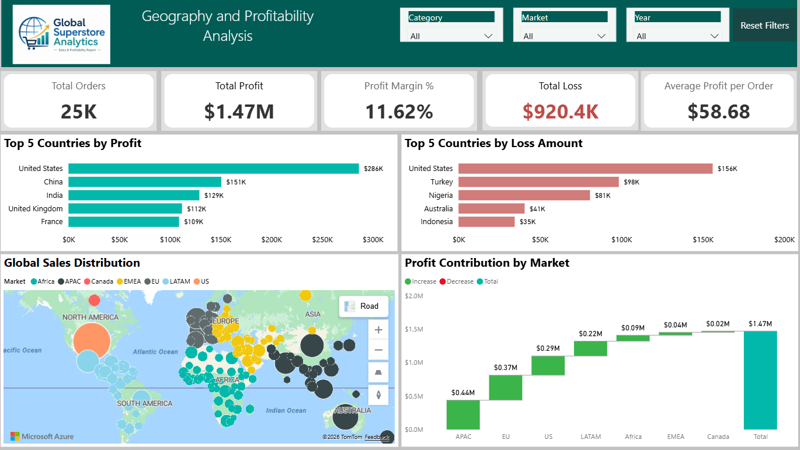

# Global Superstore Power BI Analysis
An interactive Power BI dashboard analyzing global sales, product performance, and profitability.

## Dashboard Pages

### Executive Overview

### Product Performance

### Geography and Profitability

## Key Insights

- Overall sales, profit, quantity, and order performance
- Sales and profit trends over time
- Product and category performance
- Profitability across markets and countries
- Identification of top-performing and loss-making products

## Tools Used

- Power BI
- Power Query
- DAX
- Data modeling
- Data visualization

## Files

- 'Global Superstore Sales Analysis.pbix' — Power BI report
- 'SuperStoreOrders.csv' — Original dataset
- Dashboard screenshots
  
